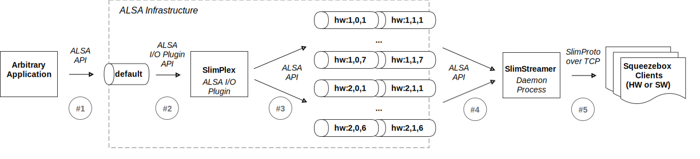

# Motivation
There is plenty of audio streaming solutions out there. However, Squeezebox ecosystem (with its community, streaming protocol, devices, software receivers, etc.) remains among most used solutions. Despite the fact that it was originated back from 2000, it is still attractive for DIY community due to its openness, multi-room synchronization and streaming quality. Squeezebox streaming protocol does not require resampling, which is a key feature for bit-perfect streaming solution (Airplay, SnapCast, etc. are not bit-perfect as they resample to a predefined sample rate). There is one particular area within Squeezebox ecosystem, which could be MUCH better – Logitech Media Server.

# So what is the problem that SlimStreamer solves?
After years of development, Logitech Media Server (LMS), a central part of Squeezebox based solution, has become a big monolithic Web application.
To be fair, it works nicely (thanks to community).
However, it has an essential drawback (which one may consider as a design flaw): everything has to be managed from LMS. Music collection (local / remote), streaming services, alarms, etc. have to be integrated within LMS through plugins or similar.
This is where SlimStreamer comes in: it decouples Squeezebox streaming capability from the rest of functionality various music apps provide.
It works like this:
Music app (MPD, Mopidy, Spotify client, whatever) plays music by sending PCM stream via ALSA interface
ALSA directs this PCM stream to SlimPlexor ALSA plugin
SlimPlexor ALSA plugin redirects to ALSA Loopback device preconfigured

