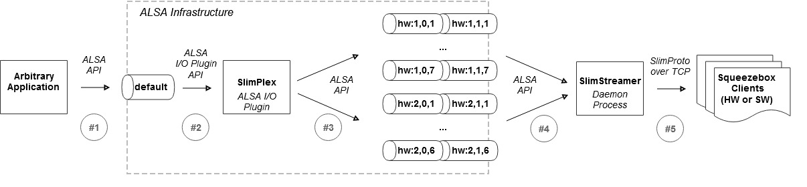

# Motivation
There is plenty of audio streaming solutions out there; however, Squeezebox ecosystem (with its community, streaming protocol, devices, software receivers, etc.) remains among most popular solutions used. Despite the fact that it was originated back from 2000, it is still attractive for DIY community due to its openness, multi-room synchronization and streaming quality. Squeezebox streaming protocol does not require resampling, which is a key feature for bit-perfect streaming solution (Airplay, SnapCast, etc. are not bit-perfect as they resample to a predefined sample rate).  
There is one particular area within Squeezebox ecosystem, which could be MUCH better – Logitech Media Server (LMS).

# So what is the problem that SlimStreamer solves?
After years of development, LMS, a central part of Squeezebox based solution, has become a big monolithic Web application.
To be fair, it works nicely (thanks to community); however, it has an essential drawback (one may consider it as a design flaw) – everything has to be managed by LMS. Music collection (local / remote), streaming services, alarms, etc. have to be integrated within LMS through plugins or similar.  
This is where SlimStreamer comes in: it decouples Squeezebox streaming capability from the rest of the functionality around managing music ([Single responsibility principle](https://en.wikipedia.org/wiki/Single_responsibility_principle)).
Any application that outputs audio to a default ALSA device can be used as music source for streaming.
In fact, audio streaming is done transparently by SlimStreamer and SlimPlexos (ALSA plugin) behind the scene.
Moreover, SlimStreamer captures PCM stream in a bit-perfect way (without resampling to a predefined sample rate), which allows streaming audio in best possible quality!

# That might be interesting… So how does it work?

   *#1* A music application (MPD, Mopidy, Spotify client, … whatever) plays music by sending PCM stream to the default ALSA device by using ALSA API  
   *#2* ALSA directs this PCM stream to SlimPlexor ALSA plugin  
   *#3* SlimPlexor ALSA plugin redirects to ALSA Loopback device preconfigured  
